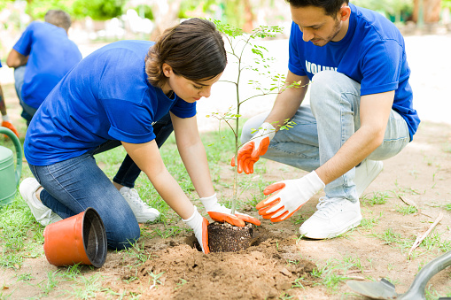
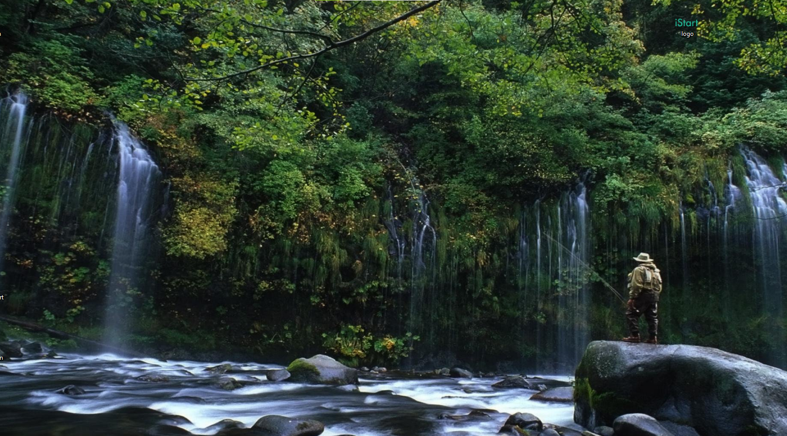

MIT License

Copyright (c) 2022 Kapgeradok

Permission is hereby granted, free of charge, to any person obtaining a copy
of this software and associated documentation files (the "Software"), to deal
in the Software without restriction, including without limitation the rights
to use, copy, modify, merge, publish, distribute, sublicense, and/or sell
copies of the Software, and to permit persons to whom the Software is
furnished to do so, subject to the following conditions:

The above copyright notice and this permission notice shall be included in all
copies or substantial portions of the Software.

THE SOFTWARE IS PROVIDED "AS IS", WITHOUT WARRANTY OF ANY KIND, EXPRESS OR
IMPLIED, INCLUDING BUT NOT LIMITED TO THE WARRANTIES OF MERCHANTABILITY,
FITNESS FOR A PARTICULAR PURPOSE AND NONINFRINGEMENT. IN NO EVENT SHALL THE
AUTHORS OR COPYRIGHT HOLDERS BE LIABLE FOR ANY CLAIM, DAMAGES OR OTHER
LIABILITY, WHETHER IN AN ACTION OF CONTRACT, TORT OR OTHERWISE, ARISING FROM,
OUT OF OR IN CONNECTION WITH THE SOFTWARE OR THE USE OR OTHER DEALINGS IN THE
SOFTWARE.

<!-- <!DOCTYPE html>
<html lang="en">
  <head>
    <meta charset="UTF-8" />
    <meta http-equiv="X-UA-Compatible" content="IE=edge" />
    <meta name="viewport" content="width=device-width, initial-scale=1.0" />
    <title>forest conservation</title>
    <link rel="stylesheet" href="style.css" />
    <link rel="stylesheet" href="./index.js">
    <link rel="stylesheet" href="./package.json">
  </head>
  <body>
    <nav>
      

        <header>
          
          <h1>forest conservation</h1>
          

            <ul>
              <li><a href="/">HOME</a></li>
              <li><a href="/">CONTRIBUTION</a></li>
              <li><a href="/">VOLUNTEER</a></li>
              <li><a href="/">GOALS</a></li>
            </ul>
          

          

            <form action="search" method="get">
              <input type="text" required />
              <button placeholder="type to search" type="">search</button>
            </form>
          

        </header>
      

    </nav>
    <section>
      

        

        
        <h2>Tree planting</h2>
        

          Planting and maintaining forests for the benefit of present and future
          generations is known as forest conservation.  A rapid shift in the
          species composition and age distribution of trees is another goal of
          forest conservation. They protect us from erosion, clean the water we
          drink, and serve as a critical barrier against climate change. Many of
          the various species of plants and animals that inhabit the earth may
          be found in forests, which also supply critical natural resources
          including food, medicine, and timber. We can depend on forests for
          shelter, work, water, food, and fuel security. All of these activities
          include forests in one way or another. Fruits, paper made from trees,
          wood from trees, and other examples are simple to understand.
        

        

        
        
        

      

    </section>
    <h3>CONTRIBUTION</h3>
    

      Additionally, forests promote resilience since they can offer safety nets
      for livelihoods and are usually consumed more frequently when food is
      scarce. When they are sold, forest and tree products can help the world's
      food system become more nutrient-sensitive. minimizing water and air
      pollution. preserving open spaces and natural areas. conserving
      biodiversity, endangered species, and habitats for fish and animals.
      managing and defending wetlands and watersheds. maintaining leisure
      facilities and beautiful environments.
    

    

      <section>
        

          <h2>VOLUNTARY</h2>
          
          
 Volunteers are concerned with wildlife conservation in
            order to safeguard wildlife species. A volunteer program that
            involves planting trees can be the perfect fit for you if you've
            been considering how you can contribute while also helping the
            environment.
          

        

        

          <h2>CONTRIBUTION</h2>
          
          

            We are aware that environmental issues like climate change and
            deforestation are a problem for our planet. People are rising to the
            occasion and acting. Around the world, environmentalists and people
            who enjoy the outdoors are working together to protect the
            environment.
          

        

        

          <h2>COMMENTS</h2>
          
          

            Planting trees improves peace and future hope as well as
            environmental conservation. It also maintains life. As the late,
            renowned environmentalist Prof. Wangari Maathai famously stated,
            "When we plant trees, we plant the seeds of peace and hope."
            Consequently, a tree serves as "a sign of hope for us.
          

        

      </section>
    

    

      <section>
        <footer>
          &copy; forest conservation made with &real; & &hearts; by Gerald
        </footer>
      </section>
    

  </body>
</html>

<!DOCTYPE html>
<html lang="en">
  <head>
    <meta charset="UTF-8" />
    <meta http-equiv="X-UA-Compatible" content="IE=edge" />
    <meta name="viewport" content="width=device-width, initial-scale=1.0" />
    <title>forest conservation</title>
    <link rel="stylesheet" href="style.css" />
    <link rel="stylesheet" href="./index.js">
    <link rel="stylesheet" href="./package.json">
  </head>
  <body>
    <nav>
      

        <header>
          
          <h1>forest conservation</h1>
          

            <ul>
              <li><a href="/">HOME</a></li>
              <li><a href="/">CONTRIBUTION</a></li>
              <li><a href="/">VOLUNTEER</a></li>
              <li><a href="/">GOALS</a></li>
            </ul>
          

          

            <form action="search" method="get">
              <input type="text" required />
              <button placeholder="type to search" type="">search</button>
            </form>
          

          <button class="ss1" onclick="document.getElementById('tm').innerHTML = Date()">The time set..</button>   

          <button class="ss1" onclick="document.getElementById('tm').innerHTML = alert('We need to do more research on forest restoration. is that ok?')">page alert</button>   

        </header>
      

      

 
    </nav>
    <section>
      

        

        
        <h2>Tree planting</h2>
        

          Planting and maintaining forests for the benefit of present and future
          generations is known as forest conservation.  A rapid shift in the
          species composition and age distribution of trees is another goal of
          forest conservation. They protect us from erosion, clean the water we
          drink, and serve as a critical barrier against climate change. Many of
          the various species of plants and animals that inhabit the earth may
          be found in forests, which also supply critical natural resources
          including food, medicine, and timber. We can depend on forests for
          shelter, work, water, food, and fuel security. All of these activities
          include forests in one way or another. Fruits, paper made from trees,
          wood from trees, and other examples are simple to understand.
        

        

        
        
        

      

    </section>
    <h3>CONTRIBUTION</h3>
    

      Additionally, forests promote resilience since they can offer safety nets
      for livelihoods and are usually consumed more frequently when food is
      scarce. When they are sold, forest and tree products can help the world's
      food system become more nutrient-sensitive. minimizing water and air
      pollution. preserving open spaces and natural areas. conserving
      biodiversity, endangered species, and habitats for fish and animals.
      managing and defending wetlands and watersheds. maintaining leisure
      facilities and beautiful environments.
    

    

      <section>
        

          <h2>VOLUNTARY</h2>
          
          
 Volunteers are concerned with wildlife conservation in
            order to safeguard wildlife species. A volunteer program that
            involves planting trees can be the perfect fit for you if you've
            been considering how you can contribute while also helping the
            environment.
          

        

        

          <h2>CONTRIBUTION</h2>
          
          

            We are aware that environmental issues like climate change and
            deforestation are a problem for our planet. People are rising to the
            occasion and acting. Around the world, environmentalists and people
            who enjoy the outdoors are working together to protect the
            environment.
          

        

        

          <h2>COMMENTS</h2>
          
          

            Planting trees improves peace and future hope as well as
            environmental conservation. It also maintains life. As the late,
            renowned environmentalist Prof. Wangari Maathai famously stated,
            "When we plant trees, we plant the seeds of peace and hope."
            Consequently, a tree serves as "a sign of hope for us.
          

        

      </section>
    

    

      <section>
        <footer>
          &copy; forest conservation made with &real; & &hearts; by Gerald
        </footer>
      </section>
    

  </body>
</html>

## css

*{
    padding: 0.2rem;
    margin: 0.2rem;
background-color: #fff;    
}
nav{
    text-decoration: wavy;
}

section div {
    font-family: Verdana, Geneva, Tahoma, sans-serif;
    align-items: center;

}

nav div header{
    display: flex;
    flex-direction: row;
    align-items: center;
    background-color: darkgreen;
    border-radius: 2.11rem;
    align-self: start;
}

 nav div header img{
    display: flex;
    height: 4.11rem;
    border-radius: 10rem;
    flex-direction: row;
    align-items: center;
    width: 4.11rem;
}

nav div header h1{
    display: flex;
    height: 4.11rem;
    flex-direction: row;
    align-items: center;
    border: 2rem;
    border-radius: 3rem;
    margin-left: 0rem;
    padding-left: 1rem;
    padding-right: 1rem;
}

nav div header div{
    display: flex;
    flex-direction: row;
    align-items: center;
    text-align: center;
    border: 2rem;
    border-radius: 3rem;
    margin-left: 13rem;
}

nav div header div ul{
    display: flex;
    flex-direction: row;
    align-items: center;
    text-align: center;
    border: 2rem;
    border-radius: 3rem;
    
}

nav div header div ul li{
    display: flex;
    flex-direction: row;
    align-items: center;
    text-align: center;
    border: 2rem;
    border-radius: 3rem;
}

nav div header div ul li a{
    display: flex;
    flex-direction: row;
    align-items: center;
    text-align: center;
    border: 2rem;
    border-radius: 3rem;
    text-decoration: none;
    color: #3d3d3d;
    font-weight: bold;
    font-style: italic;
}

nav div header div ul li a:hover{
    display: flex;
    flex-direction: row;
    align-items: center;
    text-align: center;
    border: 2rem;
    border-radius: 3rem;
    text-decoration: none;
    color: #fff;
    background-color: green;
    transition: .7s ease-in-out;
    transform-style: flat;

}

nav div header form {
    display: flex;
    flex-direction: row;
    align-items: center;
    background-color: darkgreen;
    border-radius: 2.11rem;
    padding-left: 1rem;
    color: #fff;
}

nav div header form button{
    display: flex;
    flex-direction: row;
    align-items: center;
    background-color: darkgreen;
    border-radius: 0.5rem;
    padding-left: 1rem;
    color: #fff;
}

nav div header form input{
    display: flex;
    flex-direction: row;
    align-items: center;
    background-color: darkgreen;
    border-radius: 0.5rem;
    padding-left: 1rem;
    color: #fff;
}

div{
    text-align: center;
}
div img{
    height: 25rem;
    border-radius: 1rem;
    margin: 1rem;
    display: flex;
    flex-direction: left;
}

div p{
    font-size: 17px;
    font-family: 'Times New Roman', Times, serif;
    text-align: left; 
    color: #3d3d3d;
}

 div section {
    font-size: 21px;
    text-align: center;
    align-items: center;
    display: flex;
    flex-direction: row;
    background-color: darkgreen;
    margin-bottom: 0px;
    border-radius: 1rem;
}

div section footer{
    font-size: 25px;
    background-color: darkgreen;
    margin-left: 33rem;
    padding-top: 4.11rem;
    padding-bottom:  4.11rem;
    color: #fff;
    font-weight: bold;
}

div section img{
    padding-top: 4.11rem;
    display: flex;
    flex-direction: row;
    align-items: center;
    padding-bottom:  4.11rem;
    margin-bottom: 0px;
    border-radius: 1rem;
    background-color: green;
}

div section div{
    background-color: #fff;
    margin: 1rem;
    margin-left: 4.5rem;
    padding: 2rem;
    border-radius: 2rem;
    
}

div section div img{
    height: 10rem;
    border-radius: 2rem;
    margin: 1rem;
    display: flex;
    flex-direction: left;
}

div section div p{
    height: 10rem;
    width: 18rem;
    border-radius: 2rem;
    margin: 1rem;
    display: flex;
    flex-direction: left;
}

.ss1{
    border-radius: 1rem;
    height: 3rem;
    background-color: #fff;
    color: darkgreen;
    font-weight: bold;
    margin: 1rem;
}
.ss1:hover{
    background-color: green;
    color: #fff;
    transition: .4s ease-in;
}

## js

// Examine doc obj //
// console.debug(...Audio: history[]): void;
console.dir(document);
console.log(document.domain);
console.log(document.URL);
console.log(document.URL);

console.log(document.images);
console.log(document.doctype);
console.log(document.all);
console.log(document.all[9].textContent='Please text');

getElementById//
console.log(document.getElementById('header title'));
console.log(headerTitle);
headerTitle.textContent='plant a tree';
headerTitle.innerText='Please contribute';
console.log(headerTitle.innerText);

// GET ELEMENTS BY CLASSNAME //
var my_goal= document.getElementsByClassName('it');
for (var r = 0; r < FileList.length; r++){
    div[r].style.backgroundColor='#eee';
}

//GET ELEMENTS BY TAG NAME//
var a=document.getElementsByTagName('a');
console.log(a);
console.log(a[1]);
a[1].textContent='your price';
a[1].style.fontFamily='Times New Roman';
a[1].style.alignContent='centre';

//Query selector//
var header= document.querySelector('h1');
header.style.backgroundColor='light green';
var iput= document.querySelector('input');
input.value='contribution';

let volunteer = {
    name: "Melisa",
    age: 22,
  
    toString() {
      return `{name: "${this.name}", age: ${this.age}}`;
    }
  };
  
  alert(volunteer);

// import package
import { Mpesa } from "mpesa-api";
//OR
const Mpesa = require("mpesa-api").Mpesa;

// create a new instance of the api
const mpesa = new Mpesa(credentials, environment);

//example
const credentials = {
    clientKey: 'YOUR_CONSUMER_KEY_HERE',
    clientSecret: 'YOUR_CONSUMER_SECRET_HERE',
    initiatorPassword: 'YOUR_INITIATOR_PASSWORD_HERE',
    securityCredential: 'YOUR_SECURITY_CREDENTIAL',
    certificatePath: 'keys/example.cert'
};
// For the initiator_password, use the security credential from the test credentials page.link :https://developer.safaricom.co.ke/test_credentials

// security credential is optional. Set this if you're getting Initiator Name is invalid errors. You can generate your security credential on the test credentials page for sandbox environment or from your mpesa web portal for production environment.

// certificate path is otional. I've provided ceritificates for sandbox and production by default. If you choose not to include it Pass it as null. If you have passed `securityCredential` you should pass `certificatePath` as `null`
// const credentials = {
//     ...,
//     certificatePath: null
// };

// const environment = "sandbox";
// //or
// const environment = "production";

// mpesa
  .b2b({
    InitiatorName: "Initiator Name",
    Amount: 1000 /* 1000 is an example amount */,
    PartyA: "Party A",
    PartyB: "Party B",
    AccountReference: "Account Reference",
    QueueTimeOutURL: "Queue Timeout URL",
    ResultURL: "Result URL",
    CommandID: "Command ID" /* OPTIONAL */,
    SenderIdentifierType: 4 /* OPTIONAL */,
    RecieverIdentifierType: 4 /* OPTIONAL */,
    Remarks: "Remarks" /* OPTIONAL */,
  })
  .then((response) => {
    //Do something with the response
    //eg
    console.log(response);
  })
  .catch((error) => {
    //Do something with the error;
    //eg
    console.error(error);
  });

  document.addListenerEvent("DOMContentLoaded", function(){
    const button = document.getElementById("it")
    button.addListenerEvent('click', function(){
      console.log("I can try it actually!");
    })
  });

  function contribute () {
    if (document.getElementById("contribute").value == "") {
      priceComp = 100;
    } else if (document.getElementById("comp").value == "tileadh") {
      priceComp = 650;
    } else if (document.getElementById("comp").value == "Cornerstrips") {
      priceComp = 100;
    }  else {
      priceComp= 200;
    }
    return priceComp;
  }
  
  ## json

  {
  "name": "webhook",
  "version": "1.0.0",
  "description": "M-PESA API",
  "main": "server.js",
  "scripts": {
    "test": "node server.js",
    "start": "node server.js"
  },
  "repository": {
    "type": "git",
    "url": "PHASE-1-PROJECT-GERALD"
  },
  "keywords": [
    "MPESA",
    "EXPRESS"
  ],
  "author": "GERALD",
  "license": "ISC",
  "dependencies": {
    "body-parser": "^1.20.1",
    "express": "^4.18.2",
    "prettyjson": "^1.2.5"
  }
} -->
